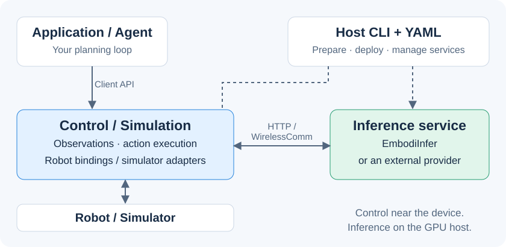
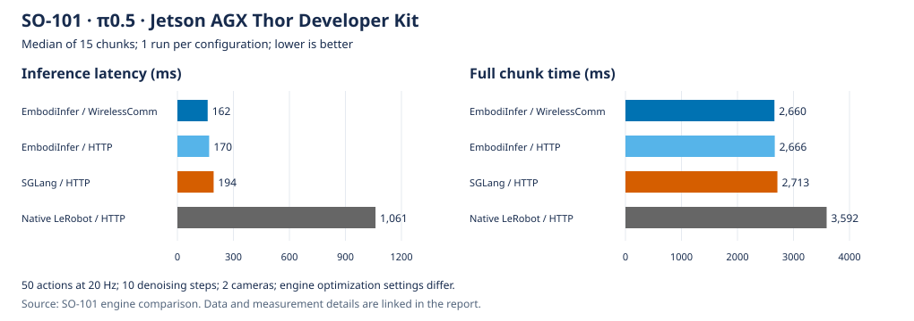

<p align="center">
  
</p>

<h3 align="center">From model predictions to robot actions.</h3>
<p align="center">
  <a href="https://embodirun.readthedocs.io/">Documentation</a> ·
  <a href="#quick-start-and-recipes">Quick start</a> ·
  <a href="#three-scenarios">Scenarios</a> ·
  <a href="#performance">Performance</a> ·
  <a href="docs/en/support-matrix.md">Support matrix</a> ·
  <a href="README.zh-CN.md">简体中文</a>
</p>

<p align="center">
  <a href="LICENSE"></a>
  <a href="pyproject.toml"></a>
  <a href="https://embodirun.readthedocs.io/"></a>
</p>

**EmbodiRun is a deployment and execution runtime for embodied AI.** Connect
robot observations to a model or agent, execute its actions, and record the
session. A YAML configuration describes the devices, inference services, and
compute nodes, so control can run beside the robot while inference runs on a
GPU host.

Use [EmbodiInfer](https://github.com/BUAA-CI-LAB/EmbodiInfer) for model inference,
connect an external service, or build a task loop with the
[Agent client](agents/CLIENT.md).

## Three scenarios

| VLA · Manipulation | VLN · Navigation | Agent · Mobile manipulation |
|---|---|---|
| [](docs/en/demos/so101-grasping.md) | [](docs/en/demos/microduck-vln.md) | [](docs/en/demos/xlerobot-snack-delivery.md) |
| **SO-101 + π0.5:** pick up a cube and place it in a bowl using camera images and joint state. | **MicroDuck + ActiveVLN:** follow a language instruction through a MuJoCo scene. | **Mobile base + SO-101 arms:** combine recorded routes, RPent/Astra scene review, and VLA grasping to deliver a snack under operator supervision. |
| [Watch and learn](docs/en/demos/so101-grasping.md) · [Recipe](examples/so101_grasping.md) | [Watch and learn](docs/en/demos/microduck-vln.md) · [Recipe](examples/microduck_vln/README.md) | [Workflow and architecture](docs/en/demos/xlerobot-snack-delivery.md) · [Recipe](examples/xlerobot_snack_delivery/README.md) |

Explore [Recipes](examples/README.md) for multiple arms, alternative inference
backends, and software-only examples. The [support matrix](docs/en/support-matrix.md)
lists robot, simulator, and model integrations.
Recipes use the shared `embodirun example` CLI; `examples/run.sh` remains a
compatible entrypoint for source checkouts.

## Why EmbodiRun

| Feature | What you can do |
|---|---|
| **Deploy across machines** | Describe nodes, environments, devices, and model services in YAML; let Host prepare and launch the deployment. |
| **Share inference across robots** | Run independent sessions and control loops against one model service, with optional π0.5 cross-session batching. |
| **Choose your transport** | Connect through HTTP or WirelessComm with versioned observation/action contracts and consistent session and step handling. |
| **Observe, execute, and record** | Reuse camera and state snapshots across agents, inference, and recording; validate actions and coordinate execution with manual takeover. |

## From predictions to execution



Model services produce predictions; agents choose task steps. EmbodiRun connects
both to the robot through shared observations, policy proposals, execution jobs,
and session recording. This lets the same application work with different
devices and service placements.

| Component | Role |
|---|---|
| **EmbodiRun** | Service deployment, robot and simulator observations, session coordination, action validation, execution, and recording. |
| [**EmbodiInfer**](https://github.com/BUAA-CI-LAB/EmbodiInfer) | Checkpoint loading, model inference, optimization, batching, and multi-GPU execution. |
| [**WirelessComm**](https://github.com/BUAA-CI-LAB/WirelessComm) | Optional transport for communication between control and inference services. |
| **RPent / Astra / your agent** | Task planning and scene review through the [Agent client](agents/CLIENT.md). |

See [Architecture](docs/en/architecture.md) for the service layout and the
[Agent workflow](docs/en/agent-workflow.md) for application integration.
[Runtime responsibilities and costs](docs/en/runtime-value.md) compares this
scope with LeRobot and ROS 2 and identifies the deployment measurements still needed.

## Performance



| Engine | Transport | Inference latency | Full chunk time |
|---|---|---:|---:|
| **EmbodiInfer** | WirelessComm | **162 ms** | **2,660 ms** |
| EmbodiInfer | HTTP | 170 ms | 2,666 ms |
| SGLang | HTTP | 194 ms | 2,713 ms |
| Native LeRobot | HTTP | 1,061 ms | 3,592 ms |

SO-101 grasping on Jetson AGX Thor: the same checkpoint, two cameras, 10 denoising
steps, and 50-step chunks at 20 Hz; medians over 15 chunks per run. EmbodiInfer
uses BF16, Inductor, CUDA graphs, and Triton attention; SGLang uses upstream
defaults and LeRobot uses eager execution.

In this configuration, EmbodiInfer with WirelessComm reduces the full chunk
time by about **26%** compared with native LeRobot. Action playback accounts for
about 2.45 seconds of each chunk.

[Conditions and timing breakdown](docs/en/demos/engine-e2e-contrast.md) ·
[Summary data and chart generator](benchmarks/engine-comparison/README.md) ·
[HTTP / WirelessComm measurements](docs/en/inference-transport.md) ·
[Model inference benchmarks](https://github.com/BUAA-CI-LAB/EmbodiInfer#performance)

## Quick start and Recipes

When testing an unmerged PR, check out its head branch before installing;
the default `main` checkout does not include that PR's changes.

### Run a local example

Install from source with Python 3.10+ and [uv](https://docs.astral.sh/uv/) 0.12.x:

```bash
git clone https://github.com/BUAA-CI-LAB/EmbodiRun.git
cd EmbodiRun
uv sync --frozen
uv run python examples/run_shared_device_fake.py
```

The example starts a local Control service with simulated joints and a fake
camera, walks through observation, execution, recording, and cancellation, then
shuts down. It runs on a laptop without a robot, checkpoint, or GPU.

### Run a task

Choose a Recipe for environment setup, configuration, launch commands, outputs,
and shutdown:

- **VLA:** [SO-101 grasping](examples/so101_grasping.md).
- **VLN:** [MicroDuck navigation in MuJoCo](examples/microduck_vln/README.md).
- **Agent:** [XLeRobot snack delivery with RPent/Astra](examples/xlerobot_snack_delivery/README.md).
- **Variants:** [Shared inference, other backends, and software examples](examples/README.md).

For a first Recipe rehearsal, use Python 3.12 and the unified CLI:

```bash
uv sync --frozen --python 3.12
uv run --frozen embodirun example init xlerobot
CONFIG=examples/local/xlerobot/example.local.yaml
uv run --frozen embodirun example "$CONFIG" validate
uv run --frozen embodirun example "$CONFIG" plan
uv run --frozen embodirun example "$CONFIG" setup --mode software
uv run --frozen embodirun example "$CONFIG" check --mode software --json
uv run --frozen embodirun example "$CONFIG" dry-run
```

This XLeRobot rehearsal uses fixtures and opens no robot or model. Use the
printed `Outputs:` directory for `run.json` and command logs; see
[outputs and shutdown](examples/README.md#outputs-and-shutdown).
MicroDuck starts with `init` → `validate` → `plan` → `setup --mode software` →
`check --mode software --json`; this checks configuration and installed metadata
without scene assets or a GPU. Native setup and Docker use its dedicated Recipe
lock. Default setup/check mode remains `simulation`: plain simulation `check`
uses CUDA/EGL and external assets, while its JSON form checks metadata and local
paths. Follow the [MicroDuck Recipe](docs/en/microduck-vln.md) before `run`,
then use its logs and `down` instructions. Software checks do not establish
model inference or navigation success.

For an existing coding Agent, follow [independent first use](docs/en/first-use.md)
and the [Agent workflow](docs/en/agent-workflow.md). Record actual commands,
missing prerequisites and help received; a document review alone is not a run.

The [deployment quick start](docs/en/quickstart.md) explains the CLI and YAML
configuration. Before enabling robot motion, complete calibration and read the
[hardware safety guide](docs/en/safety.md).

## Documentation and roadmap

| Looking for | Start here |
|---|---|
| Installation and deployment | [Installation](docs/en/installation.md) · [Quick start](docs/en/quickstart.md) · [Configuration](docs/en/configuration.md) |
| Application integration | [Independent first use](docs/en/first-use.md) · [Agent workflow](docs/en/agent-workflow.md) · [Inference API](docs/en/http_api.md) · [Python API](docs/en/api.md) |
| Complete task instructions | [Recipes](examples/README.md) |
| Deployment templates | [configs/](configs/) |
| Measurements and results | [benchmarks/](benchmarks/README.md) · [Runtime costs](docs/en/runtime-value.md) |
| Supported and planned integrations | [Support matrix and roadmap](docs/en/support-matrix.md) |

The roadmap covers additional robot Recipes, an automatic data-collection
workflow, SmolVLA and OpenVLA integration, and deployment and scaling benchmarks.

## Contributing

See [CONTRIBUTING.md](CONTRIBUTING.md) for development setup and checks.
Use [GitHub issues](https://github.com/BUAA-CI-LAB/EmbodiRun/issues) for bugs and
feature requests, and follow [SECURITY.md](SECURITY.md) for private vulnerability
reports. Community participation follows our [Code of Conduct](CODE_OF_CONDUCT.md).

## License

Apache-2.0. See [LICENSE](LICENSE), [NOTICE](NOTICE), and
[third-party notices](THIRD_PARTY_NOTICES.md). Model weights, datasets, robot
SDKs, and simulators retain their own licenses.
