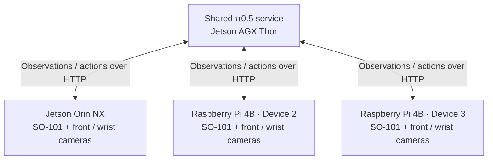

# Three robots, one inference service

Three SO-101 arms pick up a cube and place it in a bowl using the same π0.5
model service on a Jetson AGX Thor. Each robot has its own cameras, control
computer, and rollout process; model inference runs on the shared GPU host.

<video controls muted playsinline preload="metadata" width="720"
       poster="https://raw.githubusercontent.com/BUAA-CI-LAB/misc/main/embodirun/v0.1/multi_robot_serving.jpg">
  <source src="https://raw.githubusercontent.com/BUAA-CI-LAB/misc/main/embodirun/v0.1/multi_robot_serving.mp4" type="video/mp4">
  Your browser does not support the video tag.
</video>

*Front cameras above, wrist cameras below; one column per robot. The 74-second
edit aligns each recording at its own starting point.*

## Shared inference, independent control

The operator starts one rollout process for each arm with the instruction
**“Pick up the cube and place it in the bowl.”** Each process sends its robot's
two camera images and joint state to the same inference endpoint, then executes
the returned action chunk locally.

EmbodiRun handles observations, action mapping, execution, and recording on
each device. EmbodiInfer loads the checkpoint on the Thor and serves model
predictions. This keeps the model off the robot computers while letting each
robot advance through its own control loop.



## Hardware and policy

| Component | Configuration |
|---|---|
| Inference host | Jetson AGX Thor Developer Kit, 128 GB |
| Robot computers | One Jetson Orin NX (8 cores, 16 GB); two Raspberry Pi 4B boards (4 cores, 8 GB each) |
| Robots | Three SO-101 follower arms, each with front and wrist cameras |
| Camera capture | 640 × 480 MJPG, configured at 20 fps |
| Policy | π0.5, trained on SO-101 multi-arm data; BF16, 10 denoising steps, CUDA graphs |
| Recorded service configuration | One shared HTTP endpoint, `batch_size = 3` |
| Action execution | 50-step chunks, nominal 20 Hz playback |
| Recording date | September 18, 2026 |

## Pick-and-place results

All three recordings show the cube reaching the bowl. Placement times below
are measured from the beginning of each recording and identified from the video.

| Robot computer | Cube | Cube placed at | Recorded chunks | Recording duration |
|---|---|---:|---:|---:|
| Device 1 · Orin NX | Blue | 14.5 s | 53 | 191.9 s |
| Device 2 · Pi 4B | Pink | 66.0 s | 26 | 97.8 s |
| Device 3 · Pi 4B | Yellow | 9.0 s | 13 | 49.0 s |

The operator stopped each run manually, so recording continued after placement.
Device 3 later stalled because of a gripper calibration mismatch; its video
panel freezes at 21 seconds.

## Control-loop timing

The median chunk period was about **3.6 seconds** on all three devices.
Each chunk includes a 2.5-second playback budget plus roughly 1.1 seconds for
inference, communication, and recording.

| Metric | Device 1 · Orin NX | Device 2 · Pi 4B | Device 3 · Pi 4B |
|---|---:|---:|---:|
| Median chunk period | 3,588 ms | 3,622 ms | 3,620 ms |
| Playback budget | 2,500 ms | 2,500 ms | 2,500 ms |
| Remaining time | 1,088 ms | 1,122 ms | 1,120 ms |
| Recorded observation rate | 8.88 Hz | 8.46 Hz | 8.53 Hz |
| Average action rate over the recording | 13.8 Hz | 13.4 Hz | 13.3 Hz |
| Reported dropped observations / actions / missing frames | 0 / 0 / 0 | 0 / 0 / 0 | 0 / 0 / 0 |

Playback occupies about 69% of the chunk period. The pauses between chunks
bring the average action rate below the nominal 20 Hz playback rate. Observation
recording runs independently and averaged roughly 8.5 Hz.

For a breakdown of inference and transport latency on one arm, see
[Comparing inference engines on SO-101](engine-e2e-contrast.md).

## Set up a shared-service deployment

The [three-robot example](https://github.com/BUAA-CI-LAB/EmbodiRun/tree/main/examples/multi_robot_serving)
provides the deployment YAML and task settings. Copy its manifest and deployment
to local files, then fill in each robot's SSH address, device paths, calibration,
and camera mapping. Place the matching SO-101 checkpoint on the GPU host.

After completing the example's preparation steps:

```bash
CONFIG=examples/multi_robot_serving/example.local.yaml
bash examples/run.sh "$CONFIG" validate
bash examples/run.sh "$CONFIG" setup
bash examples/run.sh "$CONFIG" up --allow-hardware
bash examples/run.sh "$CONFIG" run --allow-hardware
bash examples/run.sh "$CONFIG" down
```

The launcher runs three bounded loops concurrently. The shared service batches
up to three requests in a 5 ms collection window, using smaller batches when
fewer requests are ready. Each arm keeps its own session and action sequence.
Run directories contain `run.json` and one command log per arm. See
[Reproduce the demos](../examples.md) for the manifest contract and outputs.
