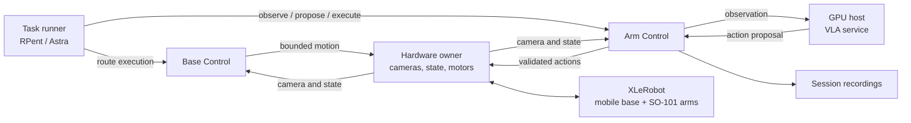

# Agent: snack delivery with XLeRobot

**“Bring me a bag of chips.”** XLeRobot drives to the table, grasps the snack,
and returns for handover. RPent/Astra reviews the scene and guides task choices;
a VLA policy generates grasp actions. EmbodiRun provides observations and
coordinates base and arm execution, with operator confirmation at arrival,
grasp, and handover.

## Watch the task

<video controls muted playsinline preload="metadata" width="720"
       poster="https://raw.githubusercontent.com/BUAA-CI-LAB/misc/main/embodirun/v0.1/xlerobot_snack_delivery/xlerobot_snack_delivery_overview.jpg">
  <source src="https://raw.githubusercontent.com/BUAA-CI-LAB/misc/main/embodirun/v0.1/xlerobot_snack_delivery/xlerobot_snack_delivery.mp4" type="video/mp4">
  Your browser does not support the video tag.
</video>

*67 seconds: request, approach, grasp, and return.*

## Prepare routes and recordings

Start by recording outbound and return routes through the hardware owner's
teleoperation interface. Resample and export them as bounded action chunks at
the configured playback rate. The [route guide](https://github.com/BUAA-CI-LAB/EmbodiRun/blob/main/examples/xlerobot_snack_delivery/guide.md#route-input-choices)
covers the recording formats and export commands.

For camera and state recording, configure a Control recorder and use the
[recording API](../agent-workflow.md) to start and stop a session and retrieve
its artifacts. Model training and dataset preparation use your existing tools;
the delivery task requires a π0.5 checkpoint compatible with the two arms.

## Deploy the services

The robot host runs one hardware owner and two Control services, scoped to the
base and arms. The owner holds the motor and camera connections. Control exposes
observations and bounded execution to the task runner.

Run the VLA service on a GPU host and set its endpoint in the deployment
configuration. Configure the RPent/Astra factory in the task JSON, then supply
the recorded routes and calibrated grasp and handover settings.



The [setup guide](https://github.com/BUAA-CI-LAB/EmbodiRun/blob/main/examples/xlerobot_snack_delivery/guide.md)
covers owner installation, calibration, route preparation, model configuration,
and the agent factory.

## Execute the delivery

1. **Approach the table.** Select and execute the recorded outbound route.
2. **Review the scene and grasp.** Use RPent/Astra review and VLA proposals to
   choose bounded grasp actions. Control validates and executes each segment.
3. **Return and hand over.** Follow the return route, move to the calibrated
   handover pose, and wait for operator confirmation.

Task output includes delivery events, review decisions, and VLA proposals,
alongside any configured session recordings.

## Try the Recipe

After `uv sync --frozen`, rehearse the task with fixture routes and feedback:

```bash
bash examples/run.sh examples/xlerobot_snack_delivery/example.yaml dry-run
```

The rehearsal runs the task sequence without starting robot, model, or Astra
services. For a physical run, follow the
[complete delivery Recipe](https://github.com/BUAA-CI-LAB/EmbodiRun/blob/main/examples/xlerobot_snack_delivery/README.md)
to create `example.local.yaml`. Start `up --allow-hardware` in one terminal
and `run --allow-hardware` in another.

- [Agent execution workflow](../agent-workflow.md)
- [XLeRobot integration](../xlerobot-snack-delivery.md)
- [Hardware safety](../safety.md)
