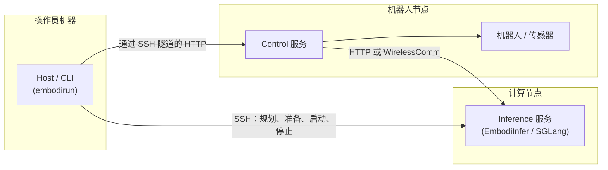
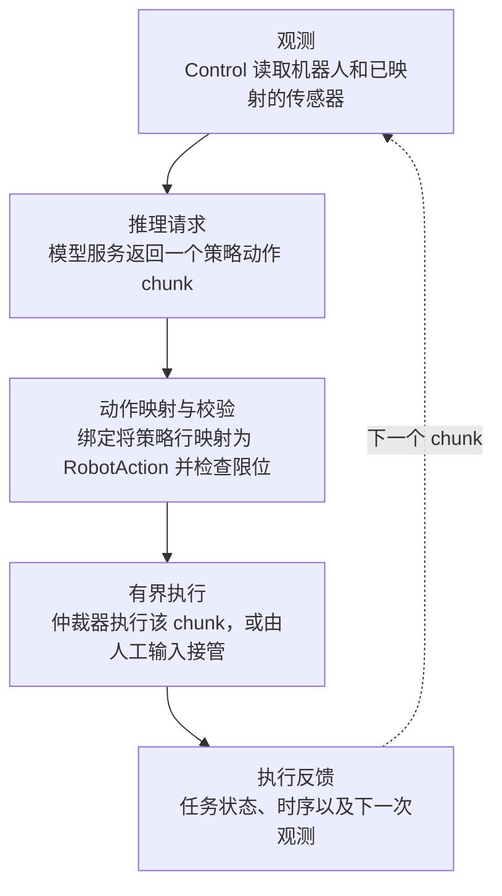

# 系统架构

EmbodiRun 部署推理与控制服务，将观测发送给模型，
并把返回的动作映射到机器人或仿真器。模型运行在独立的
推理服务中，例如 EmbodiInfer 或 SGLang。

## Host、Control 与推理服务

- **Host** 运行在操作员电脑上，解析部署配置，通过 SSH 准备源码和环境，
  校验进程身份后管理其启停，并通过 HTTP 隧道转发任务。
- **Control** 运行在机器人侧，管理硬件连接、共享观测、动作仲裁、人工输入和录制，
  通过本机回环地址提供任务 API。
- **Inference** 独立运行模型推理。可使用 EmbodiInfer，也可通过 provider 接入 SGLang。
  标记为外部服务的进程由用户自行启停。

三类服务可以部署在同一台机器上，也可以分别使用不同的机器和运行环境。

## 代码模块与职责

| 模块 | 职责 |
|---|---|
| `deployment` | 配置、规划、状态、环境、源码、SSH 与进程生命周期。 |
| `application` | 任务、动作提议、认证、执行协调以及默认模型循环。 |
| `devices` | 连接所有权、共享观测、动作仲裁、遥操作、录制。 |
| `model_services` | 版本化推理契约、HTTP/WirelessComm 客户端、provider 注册表。 |
| `client` | 用于 Control API 的无依赖公开 Agent 客户端。 |
| `robots`、`bindings`、`simulators` | 硬件适配器、策略到机器人的映射、仿真器适配器。 |
| `services` | CLI 与 HTTP 进程入口。 |

## 部署计划

`build_plan(config)` 读取 YAML，生成节点、运行环境、服务和运行时的部署计划。
生成时会校验引用、检测端口冲突，并为各绑定生成适配器配置。
`init`、`up`、`down` 和 `sync` 共用这份计划，因此 `up` 能识别初始化后的配置变更。

## 推理通信协议

Control 通过统一的[推理 API](http_api.md)访问模型服务，协议版本不随模型改变。
同一会话保持 `session_id` 不变，逐步递增 `step_id`，并为每个新请求分配唯一的 `request_id`。
重复请求可读取已缓存的响应，无需再次推理。
请求携带任务指令；模型加载、提示词构造和分词由推理服务完成。
HTTP 和 WirelessComm 使用相同的数据结构，图像以独立字节段传输，不转成 base64。

## 从观测到动作

执行回执记录已执行的动作及结束状态。应用再根据后续观测或任务指标判断任务是否成功。

## 扩展 EmbodiRun

- **新增机器人或仿真器** 实现适配器接口并注册
  其类型；之后运行时通过 `type` 引用它。
- **新增策略** 添加一个绑定，用于映射观测与动作块。
- **新增推理后端** 注册一个 provider 并随附一个客户端；
  部署与执行路径保持不变。
- **新增 agent** 使用公开的 `client` 并保留自己的规划循环。
