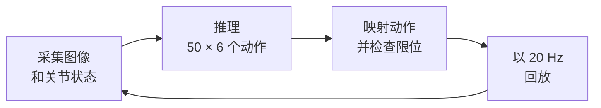

# SO-101 推理引擎对比

更快的推理会给机器人的控制回路带来多大变化？本演示在 Jetson AGX Thor 上，
分别使用 EmbodiInfer、SGLang 和原生 LeRobot 运行同一个 π0.5 抓取放置任务。
相比原生 LeRobot，EmbodiInfer 配合 WirelessComm 将推理延迟中位数
从 **1,061 ms 降至 162 ms**，一次完整控制周期的耗时从 **3.59 秒缩短至 2.66 秒**。

<video controls muted playsinline preload="metadata" width="720"
       poster="https://raw.githubusercontent.com/BUAA-CI-LAB/misc/main/embodirun/v0.1/engine_e2e_contrast.jpg">
  <source src="https://raw.githubusercontent.com/BUAA-CI-LAB/misc/main/embodirun/v0.1/engine_e2e_contrast.mp4" type="video/mp4">
  你的浏览器不支持内嵌视频。
</video>

*从左到右：使用 WirelessComm 的 EmbodiInfer、使用 HTTP 的 EmbodiInfer、SGLang，
以及原生 LeRobot。这段 29 秒的剪辑展示了各次运行的前八轮控制；
每个画面在第八轮结束后定格。*

## 任务与硬件

单台 SO-101 机械臂执行指令 **“拿起方块并将它放入
碗中。”** 所有运行都使用相同的机械臂、相机、检查点和 Wi-Fi 网络。
每次运行前都手动重置方块。

| 组件 | 配置 |
|---|---|
| 机器人 | SO-101 从臂：五个臂关节和一个夹爪 |
| 相机 | 前视和腕部，640 × 480 MJPG，配置为 20 fps |
| 控制主机 | Raspberry Pi 4 Model B，8 GB；运行控制和录制 |
| 推理主机 | Jetson AGX Thor Developer Kit，aarch64，CUDA 13 |
| 网络 | 两台主机连接到同一个 Wi-Fi 接入点 |
| 策略 | π0.5，SO-101 四臂检查点，10 个去噪步 |
| 模型输入 | 两幅图像、六维关节/夹爪状态和指令 |
| 模型输出 | 50 × 6 动作块；状态和动作采用分位数归一化 |
| 执行 | 标称 20 Hz 下的 50 个动作步 |
| 测量 | 用相机帧预热后，每种配置运行一次，执行 15 个动作块 |

## 引擎与传输设置

EmbodiInfer 在两种传输下分别测量。SGLang 和原生 LeRobot 使用
HTTP，共得到四种配置：

| 引擎 | 传输 | 执行设置 |
|---|---|---|
| EmbodiInfer | WirelessComm | BF16、Inductor、prefix 与去噪 CUDA graph、Triton attention |
| EmbodiInfer | HTTP | 与 WirelessComm 运行相同的模型和引擎设置 |
| SGLang | HTTP | 上游默认值；在设置检查中启用 `--enable-torch-compile` 没有带来改进 |
| 原生 LeRobot | HTTP | LeRobot `PI05Policy` 及其处理器，eager 执行 |

## 推理延迟与完整控制周期

下表为每次运行 15 个动作块（chunk）的耗时中位数。

| 引擎 | 传输 | 推理 | 通信 + 排队 | 动作回放 | 完整控制周期 |
|---|---|---:|---:|---:|---:|
| **EmbodiInfer** | WirelessComm | **162 ms** | 42 ms | 2,455 ms | **2,660 ms** |
| EmbodiInfer | HTTP | 170 ms | 45 ms | 2,453 ms | 2,666 ms |
| SGLang | HTTP | 194 ms | 65 ms | 2,453 ms | 2,713 ms |
| 原生 LeRobot | HTTP | 1,061 ms | 82 ms | 2,453 ms | 3,592 ms |

相比原生 LeRobot，EmbodiInfer 配合 WirelessComm 的推理加速比为 **6.5×**，
完整控制周期缩短 **932 ms，约 26%**。
EmbodiInfer 使用两种传输时，完整周期耗时接近，分别为 2,660 和 2,666 ms。

各次运行都在前八轮控制内将方块放入碗中。

## 推理加速后，时间花在哪里

每轮先采集观测，再推理并校验返回的动作块。
动作回放完成后，才开始下一轮。



50 个动作样本包含 20 Hz 下的 49 个间隔，也就是首尾样本之间的
2.45 秒。这与测得的回放时间一致，后者在四种
配置下几乎保持不变。

最快配置中，回放约占完整周期的 **92%**，原生 LeRobot 则为
**68%**。更快的推理消除了运动前的大部分等待；
机械臂执行每个动作块仍需相同的时间。
这些运行中，通信和排队约占完整周期的 2%。

## 在你的设备上复现

[引擎对比示例](https://github.com/BUAA-CI-LAB/EmbodiRun/tree/main/examples/engine_comparison)
提供 EmbodiInfer HTTP、EmbodiInfer WirelessComm 和 SGLang HTTP 三套配置。
复制所需的示例配置和部署 YAML，按 README 填入机器人、相机、检查点和 SSH 主机信息。

```bash
CONFIG=examples/engine_comparison/http.local.yaml
bash examples/run.sh "$CONFIG" validate
bash examples/run.sh "$CONFIG" setup
bash examples/run.sh "$CONFIG" up --allow-hardware
bash examples/run.sh "$CONFIG" run --allow-hardware
bash examples/run.sh "$CONFIG" down
```

每次只运行一套配置，任务之间重置场景。每次运行都会保存配置和命令日志。
视频中的原生 LeRobot 需要另行准备服务适配器，统一启动脚本未提供对应配置。

更换引擎时，保持检查点、相机映射、动作块长度和回放速率
固定不变。先用相机帧对每种配置进行预热，然后再计时，
并分别记录推理、通信和动作回放
的数据。

[配置](../configuration.md)介绍了模型和传输选择；
[推理 API v1](../http_api.md)定义了请求和响应格式。
如需专注于 HTTP/WirelessComm 的测量，请参阅
[推理传输实验](../inference-transport.md)。
启动脚本用法和输出目录说明见
[复现演示](../examples.md)中。
