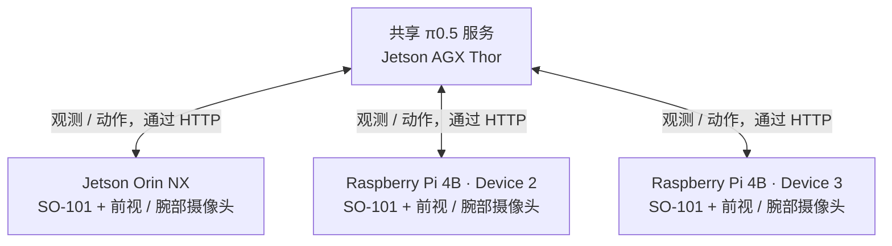

# 三台机器人共享推理服务

三台 SO-101 机械臂使用 Jetson AGX Thor 上同一个 π0.5
模型服务，把方块抓起并放入碗中。每台机器人各有自己的摄像头、控制
计算机和 rollout 进程；模型推理运行在共享的 GPU 主机上。

<video controls muted playsinline preload="metadata" width="720"
       poster="https://raw.githubusercontent.com/BUAA-CI-LAB/misc/main/embodirun/v0.1/multi_robot_serving.jpg">
  <source src="https://raw.githubusercontent.com/BUAA-CI-LAB/misc/main/embodirun/v0.1/multi_robot_serving.mp4" type="video/mp4">
  您的浏览器不支持 video 标签。
</video>

*上方为前视摄像头，下方为腕部摄像头；每台机器人一列。这段 74 秒的
剪辑按各自起点对齐了每段录像。*

## 共享推理，独立控制

操作员为每条机械臂各启动一个 rollout 进程，指令为
**“Pick up the cube and place it in the bowl.”** 每个进程把本机器人的
两路摄像头图像和关节状态发送到同一个推理端点，然后在本地执行
返回的动作块（chunk）。

EmbodiRun 负责每台设备上的观测、动作映射、执行和录制。
EmbodiInfer 在 Thor 上加载检查点并提供模型预测。
机器人侧无需加载模型，各机械臂仍按自己的控制循环运行。



## 硬件与策略

| 组件 | 配置 |
|---|---|
| 推理主机 | Jetson AGX Thor Developer Kit，128 GB |
| 机器人计算机 | 一台 Jetson Orin NX（8 核，16 GB）；两块 Raspberry Pi 4B 板（各 4 核，8 GB） |
| 机器人 | 三台 SO-101 从动机械臂，每台配前视与腕部摄像头 |
| 摄像头采集 | 640 × 480 MJPG，配置为 20 fps |
| 策略 | π0.5，在 SO-101 多臂数据上训练；BF16，10 步去噪，CUDA graph |
| 记录的服务配置 | 一个共享 HTTP 端点，`batch_size = 3` |
| 动作执行 | 每个动作块 50 步，以标称 20 Hz 回放 |
| 录制日期 | 2026 年 9 月 18 日 |

## 任务完成情况

三台机械臂均将方块放入碗中。下表根据录像判定完成时刻，从各段录像起点计时。

| 机器人计算机 | 方块 | 放置时间 | 录制的动作块数 | 录像时长 |
|---|---|---:|---:|---:|
| Device 1 · Orin NX | 蓝色 | 14.5 s | 53 | 191.9 s |
| Device 2 · Pi 4B | 粉色 | 66.0 s | 26 | 97.8 s |
| Device 3 · Pi 4B | 黄色 | 9.0 s | 13 | 49.0 s |

操作员手动停止了每次运行，因此放置之后录像仍在继续。
Device 3 后来因夹爪标定不匹配而停滞；它的视频
面板在 21 秒处定格。

## 每轮控制耗时

三台设备每轮控制的耗时中位数都约为 **3.6 秒**。
其中按配置预留 2.5 秒回放动作，另有约 1.1 秒用于
推理、通信和录制。

| 指标 | Device 1 · Orin NX | Device 2 · Pi 4B | Device 3 · Pi 4B |
|---|---:|---:|---:|
| 控制周期中位数 | 3,588 ms | 3,622 ms | 3,620 ms |
| 回放预算 | 2,500 ms | 2,500 ms | 2,500 ms |
| 剩余时间 | 1,088 ms | 1,122 ms | 1,120 ms |
| 录制观测速率 | 8.88 Hz | 8.46 Hz | 8.53 Hz |
| 录像期间的平均动作速率 | 13.8 Hz | 13.4 Hz | 13.3 Hz |
| 报告的丢弃观测 / 动作 / 缺失帧 | 0 / 0 / 0 | 0 / 0 / 0 | 0 / 0 / 0 |

动作回放约占控制周期的 69%。各轮之间的停顿
使平均动作速率低于标称的 20 Hz 回放速率。观测
录制独立运行，平均约为 8.5 Hz。

关于单条机械臂上推理与传输延迟的明细，请参见
[在 SO-101 上比较推理引擎](engine-e2e-contrast.md)。

## 复现多机器人部署

[三机器人示例](https://github.com/BUAA-CI-LAB/EmbodiRun/tree/main/examples/multi_robot_serving)
提供部署 YAML 和任务配置。复制为本地配置后，填写各机器人的 SSH 地址、设备路径、
标定信息和相机映射，并将匹配的 SO-101 检查点放到 GPU 主机上。

完成示例的准备步骤后：

```bash
CONFIG=examples/multi_robot_serving/example.local.yaml
bash examples/run.sh "$CONFIG" validate
bash examples/run.sh "$CONFIG" setup
bash examples/run.sh "$CONFIG" up --allow-hardware
bash examples/run.sh "$CONFIG" run --allow-hardware
bash examples/run.sh "$CONFIG" down
```

启动脚本并发运行三个控制循环，各自按配置限制执行范围。共享服务在 5 ms 的收集窗口内
最多批处理三个请求，就绪请求较少时使用更小的批次。
每条机械臂保留自己的会话和动作序列。
运行目录包含 `run.json` 和各机械臂的命令日志。配置格式与输出说明见
[复现演示](../examples.md)。
