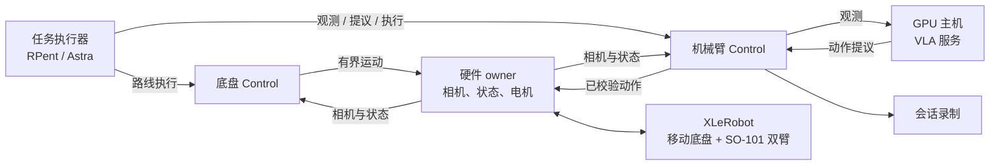

# Agent：XLeRobot 零食递送

**“帮我拿一包薯片。”** XLeRobot 驶向桌边，抓取零食，再返回递交。
RPent/Astra 负责场景判断和任务选择，VLA 策略生成抓取动作。
EmbodiRun 提供观测并协调底盘与机械臂执行，抵达、抓取和递交阶段由操作员确认。

## 观看任务演示

<video controls muted playsinline preload="metadata" width="720"
       poster="https://raw.githubusercontent.com/BUAA-CI-LAB/misc/main/embodirun/v0.1/xlerobot_snack_delivery/xlerobot_snack_delivery_overview.jpg">
  <source src="https://raw.githubusercontent.com/BUAA-CI-LAB/misc/main/embodirun/v0.1/xlerobot_snack_delivery/xlerobot_snack_delivery.mp4" type="video/mp4">
  你的浏览器不支持内嵌视频。
</video>

*67 秒：接收指令、驶向桌边、抓取、返回。*

## 准备路线与采集记录

先通过硬件 owner 的遥操作接口录制去程与返程路线，再按配置的回放频率重采样，
导出有长度限制的动作块。[路线指南](https://github.com/BUAA-CI-LAB/EmbodiRun/blob/main/examples/xlerobot_snack_delivery/guide.md#route-input-choices)
介绍录制格式与导出命令。

需要录制相机与状态时，配置 Control recorder，通过[录制 API](../agent-workflow.md)启动、
停止会话并获取产物。数据集整理与模型训练使用现有工具；递送任务需要兼容双臂的 π0.5 检查点。

## 部署服务

机器人主机运行一个硬件 owner 和两个 Control 服务，分别负责底盘与机械臂。
owner 持有电机和相机连接，Control 向任务执行器提供观测与有界执行接口。

在 GPU 主机启动 VLA 服务，将地址写入部署配置。在任务 JSON 中设置 RPent/Astra factory，
并填入录制路线、标定后的抓取参数与递交姿态。



[配置指南](https://github.com/BUAA-CI-LAB/EmbodiRun/blob/main/examples/xlerobot_snack_delivery/guide.md)
涵盖 owner 安装、标定、路线准备、模型配置和 Agent factory。

## 执行递送

1. **驶向桌边。** 选择并执行录制的去程路线。
2. **判断场景并抓取。** 结合 RPent/Astra 场景判断与 VLA 动作提议，选择有界抓取动作；
   Control 校验并执行每个动作片段。
3. **返回并递交。** 执行返程路线，移动到标定后的递交姿态，等待操作员确认。

任务输出包含递送事件、场景判断与 VLA 动作提议，可与已配置的会话录制一同保存。

## 运行 Recipe

执行 `uv sync --frozen` 后，使用预设路线和反馈演练任务：

```bash
bash examples/run.sh examples/xlerobot_snack_delivery/example.yaml dry-run
```

演练只运行任务步骤，不启动机器人、模型或 Astra 服务。真机运行请按
[完整递送 Recipe](https://github.com/BUAA-CI-LAB/EmbodiRun/blob/main/examples/xlerobot_snack_delivery/README.md)
创建 `example.local.yaml`，在一个终端执行 `up --allow-hardware`，
在另一个终端执行 `run --allow-hardware`。

- [Agent 执行工作流](../agent-workflow.md)
- [XLeRobot 集成](../xlerobot-snack-delivery.md)
- [硬件安全](../safety.md)
