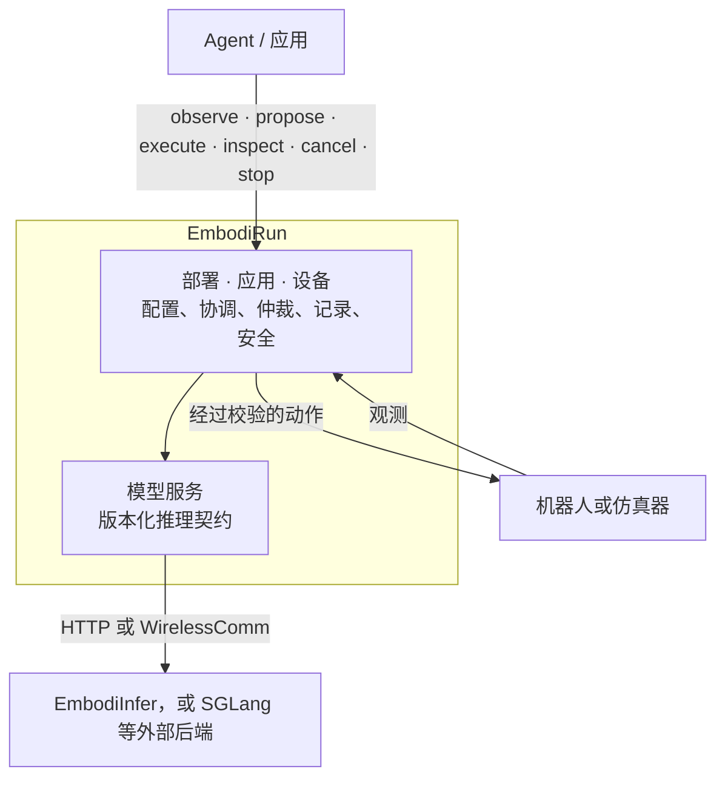

<h1 class="hero-title">
  
</h1>

**具身智能，开箱即跑。**

用一份配置连接模型、计算节点与机器人或仿真器，跑通观测、推理和动作执行。

[快速开始](quickstart.md){ .md-button .md-button--primary }
[架构](architecture.md){ .md-button }
[GitHub](https://github.com/BUAA-CI-LAB/EmbodiRun){ .md-button }

EmbodiRun 负责服务部署、跨节点通信和机器人执行，让同一套配置能够重复运行。
配套推理引擎 [EmbodiInfer](https://github.com/BUAA-CI-LAB/EmbodiInfer) 提供高性能模型推理，也支持独立使用。

## 从这里开始

-   :material-rocket-launch:{ .lg .middle } __部署__

    ---

    从源码安装，运行一个无需设备的示例，然后编写部署 YAML。

    [:octicons-arrow-right-24: 快速开始](quickstart.md)

    [:octicons-arrow-right-24: 配置](configuration.md)

-   :material-robot:{ .lg .middle } __操作机器人__

    ---

    控制权限、有界执行、人工接管和软件急停。

    [:octicons-arrow-right-24: 控制](control.md)

    [:octicons-arrow-right-24: 安全](safety.md)

-   :material-connection:{ .lg .middle } __集成模型或 Agent__

    ---

    通过版本化推理 API 连接策略和 Agent。

    [:octicons-arrow-right-24: 推理 API v1](http_api.md)

    [:octicons-arrow-right-24: RPent](rpent-integration.md)

-   :material-sitemap:{ .lg .middle } __了解系统设计__

    ---

    部署、推理服务和机器人控制如何协同工作。

    [:octicons-arrow-right-24: 架构](architecture.md)

    [:octicons-arrow-right-24: 支持矩阵](support-matrix.md)

## 系统如何协作

## 选择设备与示例

浏览[支持的机器人、仿真器和模型](support-matrix.md)，或者
从[四个演示示例](examples.md)中选一个开始。每个示例都包含
配置文件、启动命令以及对其输出的说明。
有关延迟测量和传输对比，请参见[实验](experiments.md)。

## 社区

- [贡献指南（英文）](https://embodirun.readthedocs.io/en/latest/contributing/) ——
  开发环境搭建、测试和拉取请求。
- [行为准则（英文）](https://embodirun.readthedocs.io/en/latest/code-of-conduct/) ——
  本项目采用的 Contributor Covenant 2.1 贡献者公约。
- [安全策略](https://github.com/BUAA-CI-LAB/EmbodiRun/blob/main/SECURITY.md)
  —— 如何非公开地报告漏洞。
- [许可证（英文）](https://embodirun.readthedocs.io/en/latest/license/) ——
  Apache-2.0 与第三方声明。

仓库 README 提供
[英文](https://github.com/BUAA-CI-LAB/EmbodiRun/blob/main/README.md) 和
[简体中文](https://github.com/BUAA-CI-LAB/EmbodiRun/blob/main/README.zh-CN.md) 两个版本。
